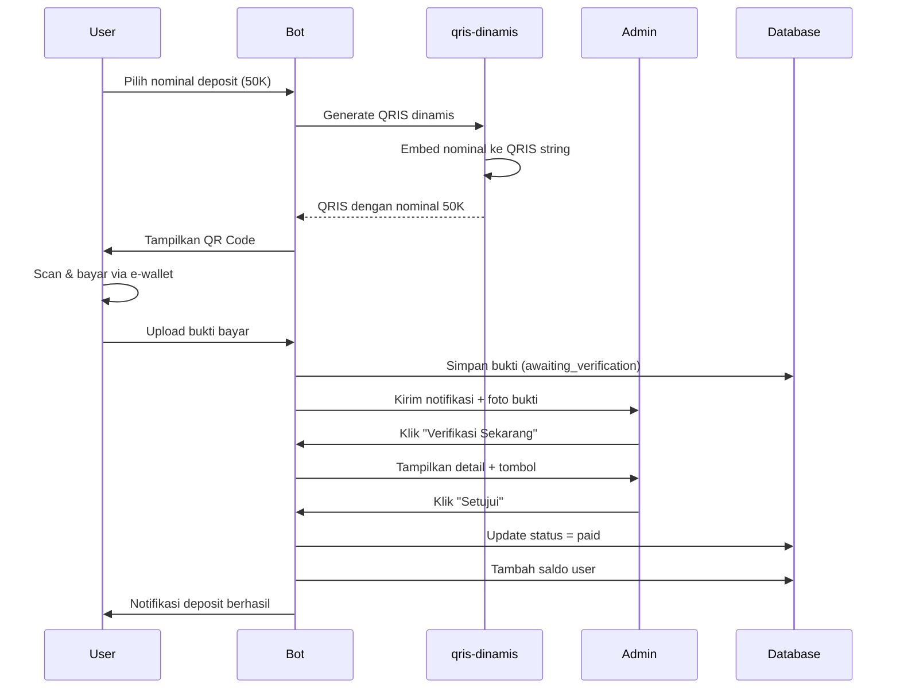

# Setup QRIS Statis (Dana Bisnis, ShopeePay, GoPay Merchant, dll)

Panduan lengkap untuk setup QRIS statis dengan verifikasi manual admin sebagai alternatif dari Midtrans.

## 📋 Daftar Isi

- [Keuntungan QRIS Statis](#keuntungan-qris-statis)
- [Persiapan](#persiapan)
- [Langkah-langkah Setup](#langkah-langkah-setup)
- [Cara Kerja](#cara-kerja)
- [FAQ](#faq)

---

## 🎯 Keuntungan QRIS Statis

### ✅ Kelebihan
- **Gratis**: Tidak ada biaya transaksi seperti payment gateway
- **Mudah**: Hanya perlu QR code dari merchant e-wallet
- **Fleksibel**: Support Dana Bisnis, ShopeePay Merchant, GoPay Merchant, dll
- **Nominal Dinamis**: Menggunakan library untuk embed nominal secara otomatis

### ⚠️ Kekurangan
- **Manual Verification**: Admin harus approve setiap deposit
- **Tidak Real-time**: User harus upload bukti pembayaran
- **Memerlukan Admin**: Harus ada admin yang standby untuk verifikasi

---

## 🛠️ Persiapan

### 1. Akun Merchant E-Wallet

Anda memerlukan salah satu dari:
- **Dana Bisnis** (https://www.dana.id/bisnis)
- **ShopeePay Merchant** (https://shopee.co.id/business)
- **GoPay Merchant** (https://www.gojek.com/gopay-merchant/)
- **OVO Business** (https://www.ovo.id/business)
- E-wallet lain yang support QRIS

### 2. QR Code Statis

Dapatkan QR code statis dari dashboard merchant e-wallet Anda:
- Login ke dashboard merchant
- Cari menu "QRIS" atau "QR Code"
- Download/Screenshot QR code statis

---

## 📝 Langkah-langkah Setup

### Step 1: Extract String dari QR Code

1. **Buka website QR Scanner**
   ```
   https://www.imagetotext.info/qr-code-scanner
   ```

2. **Upload QR Code Anda**
   - Klik "Choose File" atau drag & drop
   - Upload screenshot/file QR code merchant

3. **Copy String QRIS**
   
   Hasil akan berupa string panjang seperti ini:
   ```
   00020101021126570011ID.DANA.WWW011893600915319021669702091902166970303UMI51440014ID.CO.QRIS.WWW0215ID10254370410780303UMI5204654053033605802ID5906SeTORE600412286105621616304BB06
   ```

   **PENTING**: Copy seluruh string, dari awal sampai akhir!

### Step 2: Konfigurasi Bot

1. **Edit file `.vars.json`**
   
   ```json
   {
     "BOT_TOKEN": "your_bot_token",
     "USER_ID": "your_user_id",
     "ADMIN_USERNAME": "your_admin_username",
     "GROUP_ID": "your_group_id",
     "NAMA_STORE": "Nama Toko Anda",
     "PORT": "50123",
     "DATA_QRIS": "00020101021126570011ID.DANA.WWW0118936009153190216697020919021...",
     "MERCHANT_ID": "",
     "SERVER_KEY": ""
   }
   ```

2. **Field yang penting:**
   - `DATA_QRIS`: Paste string QRIS yang tadi di-copy
   - `ADMIN_USERNAME`: Username Telegram admin (tanpa @)
   - `MERCHANT_ID` & `SERVER_KEY`: **Kosongkan** jika hanya pakai QRIS statis

### Step 3: Restart Bot

```bash
npm run dev
# atau
pm2 restart bot-telegram
```

### Step 4: Test QRIS

1. **User Flow:**
   - User: `/start` → Top Up → Pilih nominal (misal 50.000)
   - Bot menampilkan QR code dengan nominal **sudah otomatis terisi**
   - User scan QR → Nominal sudah 50.000 (tidak perlu input manual)
   - User bayar → Upload bukti pembayaran

2. **Admin Flow:**
   - Admin menerima notifikasi langsung di Telegram
   - Admin klik "✅ Verifikasi Sekarang"
   - Lihat bukti pembayaran + detail deposit
   - Klik "✅ Setujui" atau "❌ Tolak"

---

## 🔄 Cara Kerja

### Flow Lengkap



### Library yang Digunakan

Bot menggunakan **`@agungjsp/qris-dinamis`** untuk membuat QRIS dinamis:

```javascript
const qrisDinamis = require('@agungjsp/qris-dinamis');

// QRIS statis dari merchant
const staticQRIS = "00020101021126570011ID.DANA.WWW...";

// Generate QRIS dengan nominal tertentu
const dynamicQRIS = qrisDinamis.makeString(staticQRIS, { 
  nominal: '50000' 
});

// Hasil: QRIS dengan nominal 50.000 sudah embed
```

**Keuntungan:**
- ✅ User tidak perlu input manual saat bayar
- ✅ Mengurangi kesalahan nominal
- ✅ Lebih cepat dan user-friendly

---

## ❓ FAQ

### 1. Apakah bisa pakai QRIS dari aplikasi personal (bukan merchant)?

**Tidak disarankan**. QRIS personal biasanya:
- Tidak support nominal dinamis
- Ada batas transaksi harian
- Terlihat tidak profesional

Gunakan akun **merchant/bisnis** untuk pengalaman terbaik.

### 2. Berapa lama proses verifikasi manual?

Tergantung kecepatan admin. Dengan notifikasi real-time:
- Admin langsung dapat notif di Telegram
- Bisa approve dalam <1 menit
- User langsung dapat konfirmasi

### 3. Apakah bisa pakai Midtrans DAN QRIS statis bersamaan?

**Ya!** Prioritasnya:
1. **Midtrans** (jika `MERCHANT_ID` & `SERVER_KEY` terisi) → Auto-verify
2. **QRIS Statis** (jika hanya `DATA_QRIS` terisi) → Manual verify
3. **Fallback**: Midtrans error → gunakan QRIS statis

### 4. Bagaimana jika QR code saya berubah?

Jika merchant update QR code:
1. Scan QR baru di https://www.imagetotext.info/qr-code-scanner
2. Copy string baru
3. Update `DATA_QRIS` di `.vars.json`
4. Restart bot

### 5. Berapa nominal minimal dan maksimal?

Default settings:
- **Minimal**: Rp 5.000
- **Maksimal**: Unlimited (tergantung limit merchant Anda)
- **Max digit**: 12 digit (999.999.999.999)

### 6. Apakah transaksi aman?

✅ **Ya, aman!**
- User bayar langsung ke rekening merchant Anda
- Bot hanya mencatat transaksi
- Tidak ada pihak ketiga yang handle uang
- Admin verifikasi sebelum saldo masuk

### 7. Bagaimana cara mendapatkan akun merchant?

**Dana Bisnis:**
- Website: https://www.dana.id/bisnis
- Syarat: KTP, NPWP, Foto Tempat Usaha
- Approval: 1-3 hari kerja

**ShopeePay Merchant:**
- Via app Shopee → ShopeePay → Bisnis
- Atau: https://shopee.co.id/business
- Syarat: Sama seperti Dana

**GoPay Merchant:**
- Via app Gojek atau https://www.gojek.com/gopay-merchant/
- Syarat: KTP, NPWP, minimal 6 bulan operasional

### 8. Apakah ada biaya transaksi?

**Tidak ada biaya dari bot!**

Biaya hanya dari merchant e-wallet (jika ada):
- Dana Bisnis: Gratis untuk penerima
- ShopeePay: 0.7% dari setiap transaksi
- GoPay: Bervariasi tergantung paket

---

## 🆘 Troubleshooting

### QR Code tidak bisa di-scan

**Solusi:**
1. Pastikan string `DATA_QRIS` lengkap (tidak terpotong)
2. Copy ulang dari QR scanner
3. Pastikan tidak ada spasi di awal/akhir string

### Nominal tidak otomatis terisi

**Solusi:**
1. Cek library sudah ter-install: `npm list @agungjsp/qris-dinamis`
2. Jika belum: `npm install @agungjsp/qris-dinamis`
3. Restart bot

### Admin tidak dapat notifikasi

**Solusi:**
1. Cek `ADMIN_USERNAME` di `.vars.json` benar
2. Admin harus pernah `/start` bot (agar masuk database)
3. Role admin harus 'admin' atau 'owner' di database

### Bukti pembayaran tidak muncul

**Solusi:**
1. Pastikan upload format foto (JPG/PNG)
2. Cek size foto tidak terlalu besar (max 20MB)
3. Coba upload ulang

---

## 📞 Support

Jika masih ada masalah:
1. Cek log bot: `npm run dev` atau `pm2 logs bot-telegram`
2. Buat issue di GitHub repository
3. Kontak developer

---

**Happy selling! 🚀**
